# Diagramas del Sistema SUCI

## Arquitectura General

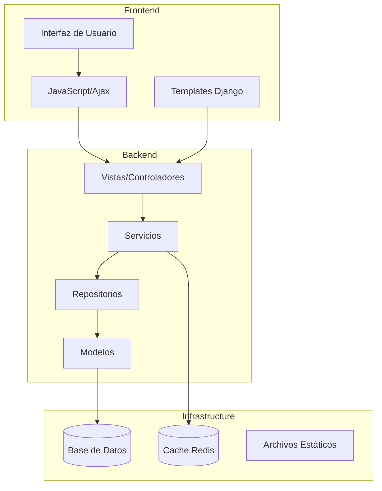

## Flujo de Autenticación

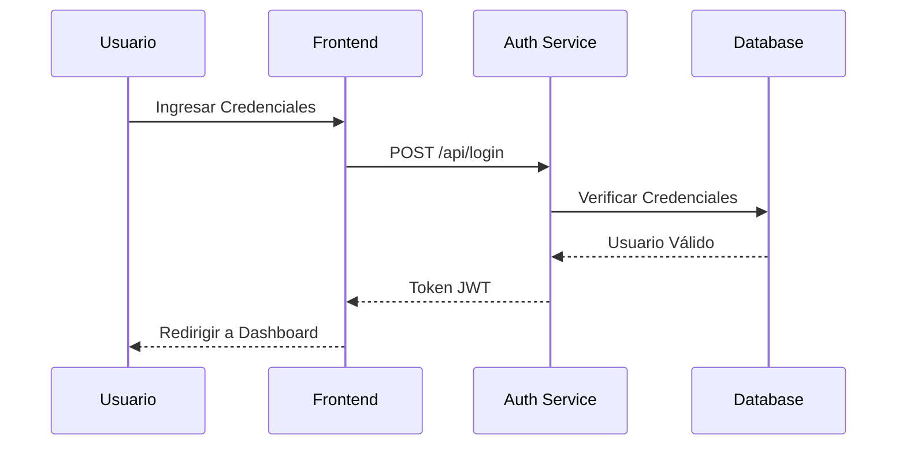

## Estructura de Módulos

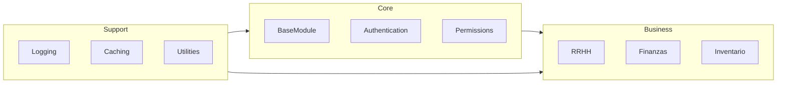

## Flujo CRUD

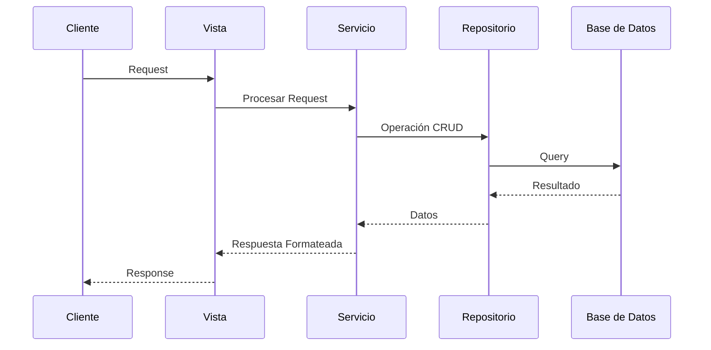

## Modelo de Datos

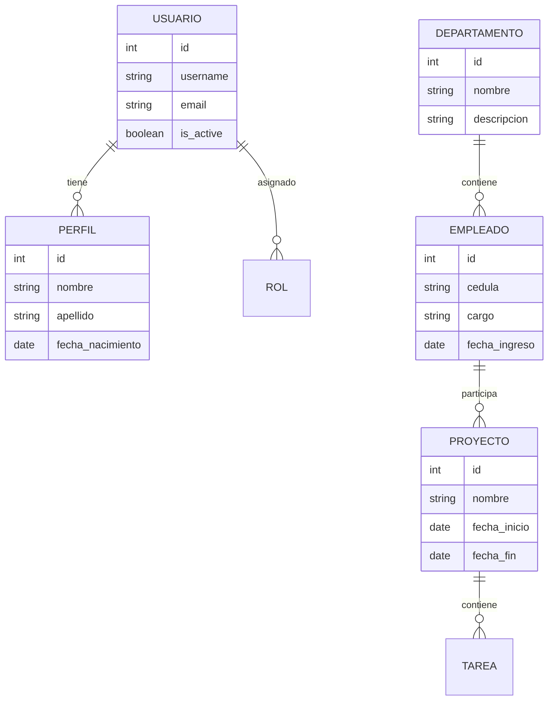

## Arquitectura de Microservicios

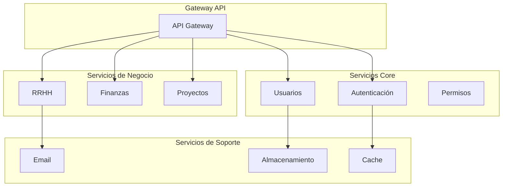

## Proceso de CI/CD

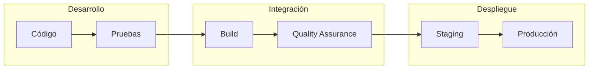

## Sistema de Cache

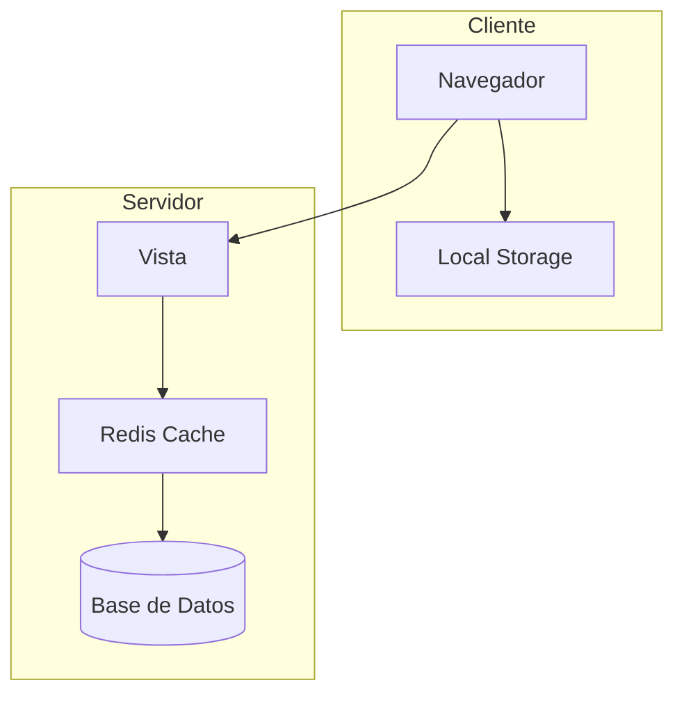

## Manejo de Sesiones

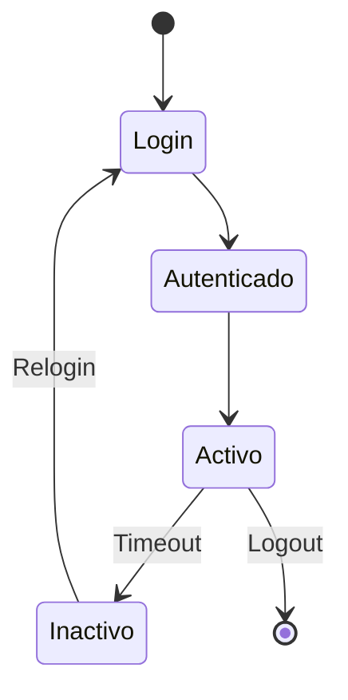

## Flujo de Notificaciones

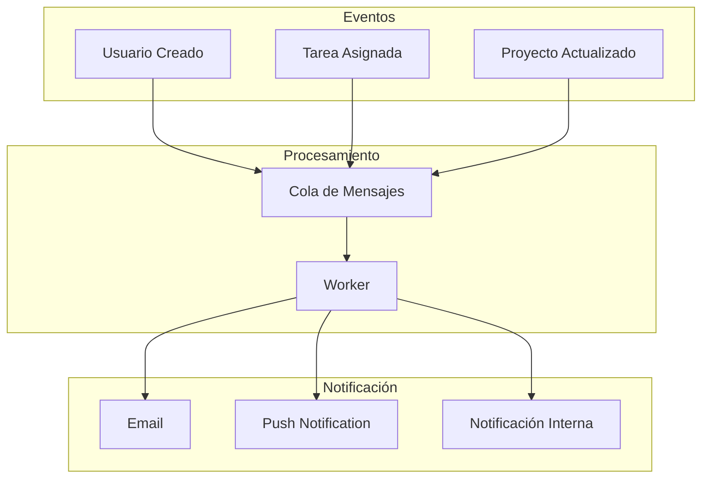

## Arquitectura de Seguridad

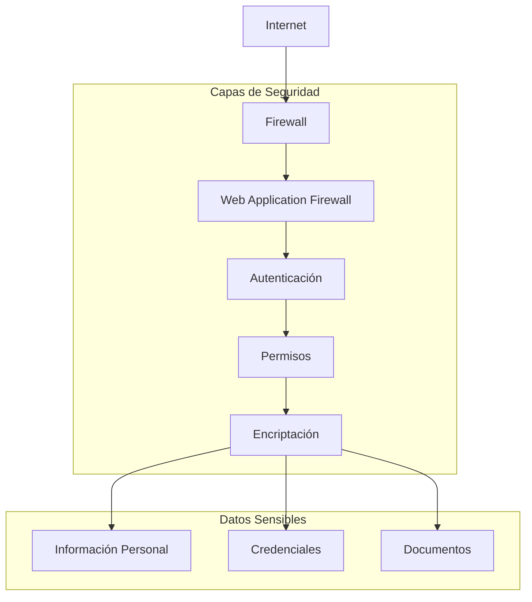

## Sistema de Logs

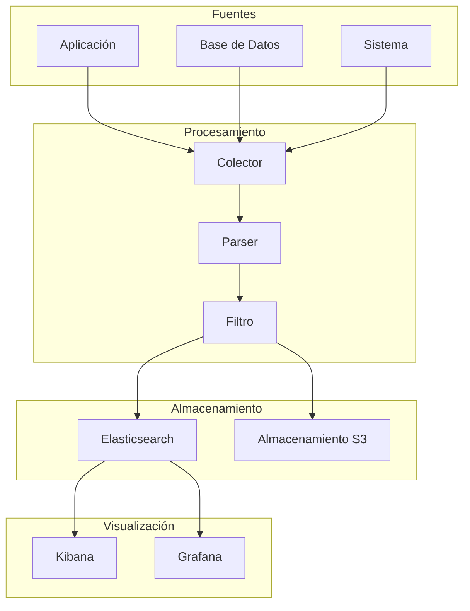

## Integración de Servicios

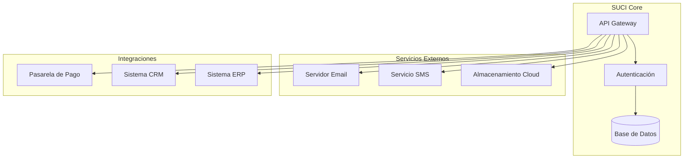

## Sistema de Reportes

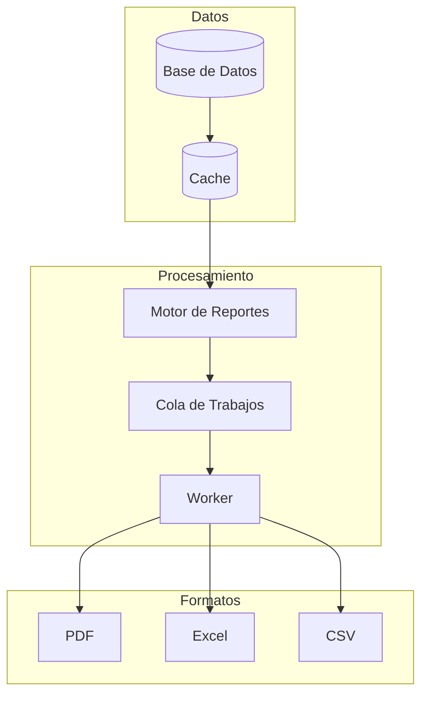